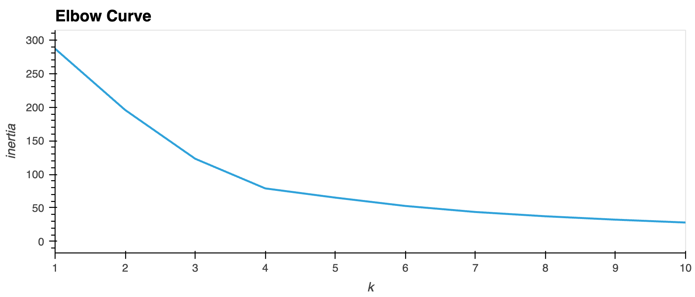
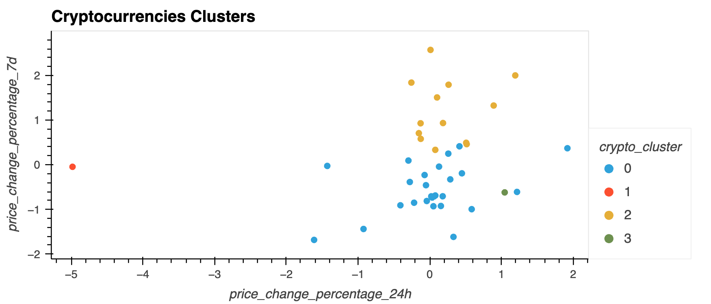
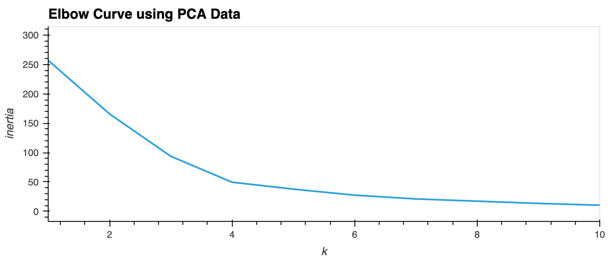
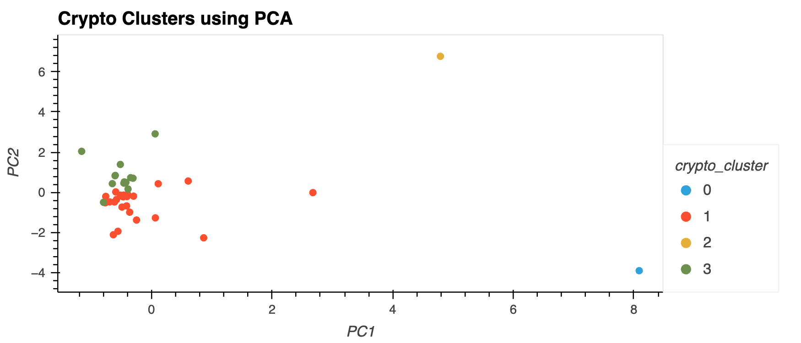

# CryptoClustering

In this example, unsupervised learning is used to cluster coin_ids based on market data. The data is located in this repo in the Resources folder. 

Elbow data was used to help identify the best number of clusters to group this data. The results suggest that 4 clusters is optimal.

A model was used to cluster the data while using all features. That image is located below.

Later, a PCA model was used to summarize the features. This means that with fewer features inserted into the model, that one could run the model faster or with fewer resources. One can conclude that similar results are achieved. This is great news because that means one could use the model to cluster the data faster and more efficiently.

